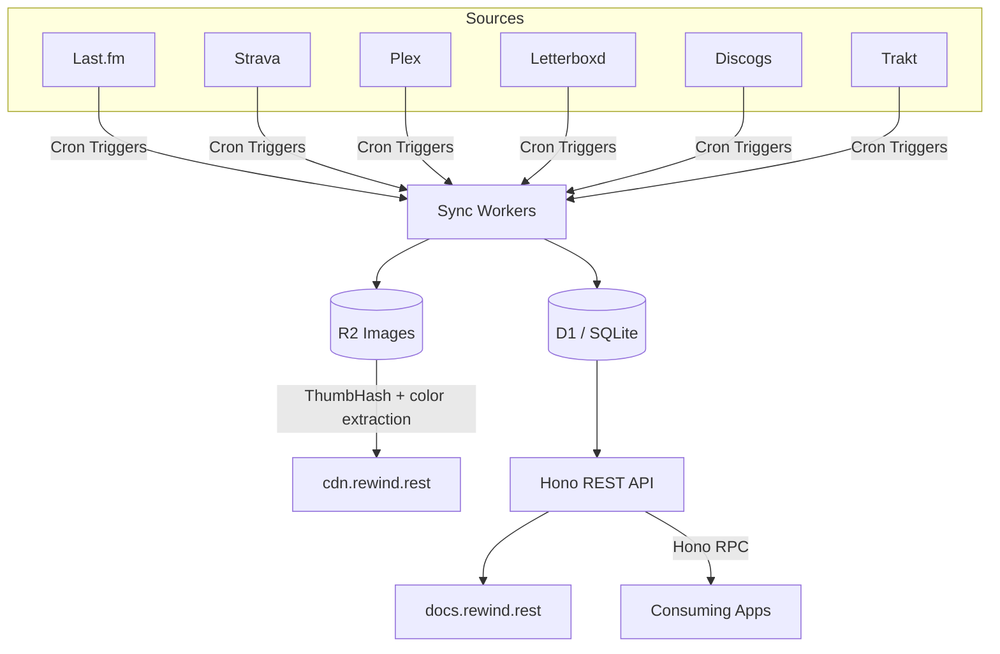

# Architecture



## Authentication

GET endpoints require a read key (`rw_live_...`). Write endpoints (admin, sync, webhooks) require an admin key (`rw_admin_...`). Keys are SHA-256 hashed and looked up in the `api_keys` table. Auth lookups are cached in-memory with a 60-second TTL per isolate. Rate limiting is per-key sliding window, default 60 RPM.

## Sync Schedule

| Domain     | Trigger        | Schedule                             | Strategy                                          |
| ---------- | -------------- | ------------------------------------ | ------------------------------------------------- |
| Last.fm    | Cron           | Every 15 min (scrobbles), 3 AM daily | Incremental from last scrobble timestamp          |
| Strava     | Cron + Webhook | 3:15 AM daily + real-time webhook    | Incremental since last synced activity            |
| Plex       | Webhook + Cron | Real-time webhook + 3:30 AM daily    | Webhook for watch events, cron for library scan   |
| Letterboxd | Cron           | Every 6 hours                        | RSS feed parse, deduplicate against existing data |
| Discogs    | Cron           | Sunday 3:45 AM                       | Full collection replace                           |
| Trakt      | Cron           | Sunday 3:45 AM                       | Full collection sync with write-through           |

Sync runs are recorded in `sync_runs` with status, item count, duration, and errors. Consecutive failures (max 2) degrade the domain; a success resets the counter.

### Post-Sync Pipeline

Every sync calls `afterSync()` which drives three things:

1. **Activity feed** -- inserts events into `activity_feed`, deduplicated by source_id + domain. Only new discoveries for listening (not every scrobble).
2. **Search index** -- upserts into FTS5 `search_index` for cross-domain full-text search.
3. **Revalidation hooks** -- fires POST to registered webhook URLs, filtered by domain, for ISR cache busting.

Each step is independent -- a failure in one doesn't block the others.

## Image Pipeline

```text
Entity needs image
  -> Check images table
  -> [miss] Run source waterfall:
       Albums:   Cover Art Archive -> iTunes -> Apple Music
       Artists:  Apple Music -> Fanart.tv
       Movies:   TMDB (poster + backdrop)
       Releases: Discogs images
  -> Fetch from source
  -> Upload to R2
  -> Generate ThumbHash placeholder
  -> Extract dominant + accent colors
  -> Store metadata in images table
```

R2 keys follow `{domain}/{entity_type}/{entity_id}/original.{ext}`. CDN URL: `cdn.rewind.rest/{r2_key}`.

Images can be manually overridden via admin endpoints. Overrides persist through future syncs and can be reverted to re-run the automatic pipeline.

## Caching

| Pattern             | Cache-Control                         | Why                                 |
| ------------------- | ------------------------------------- | ----------------------------------- |
| `now-playing`       | `no-store`                            | Real-time                           |
| `recent/*`          | `public, max-age=60`                  | Updates frequently                  |
| `stats/*`, `top/*`  | `public, max-age=3600`                | Computed aggregates, hourly is fine |
| Past year calendars | `public, max-age=86400, immutable`    | Historical data doesn't change      |
| `collecting/*`      | `public, max-age=86400`               | Weekly sync only                    |
| `images/*`          | `public, max-age=31536000, immutable` | Content-addressed in R2             |
| `feed`              | `public, max-age=300`                 | 5-minute freshness                  |
| `health`, `admin`   | `no-store`                            | Diagnostic / mutations              |

## Known Gotchas

- **D1 is SQLite** -- no PostGIS, no `generate_series`. Polylines are stored encoded, decoded client-side. Calendar/streak queries use recursive CTEs.
- **Workers subrequest limit** -- 1000 per invocation. Sync batches items (150 per domain) to stay within this.
- **Strava token rotation** -- refresh token rotates on every exchange, must be persisted immediately.
- **Plex webhooks need Plex Pass** -- without it, falls back to cron-only polling.
- **No native image decoding in Workers** -- ThumbHash requires decoding via `jpeg-js`/`fast-png` (pure JS decoders) since `sharp`/`canvas` aren't available.
- **Last.fm artist images deprecated** -- removed from API in 2020, sourced from Apple Music/Fanart.tv instead.
- **FTS5 search_index has no user_id** -- multi-user filtering must join back to source entity tables.
